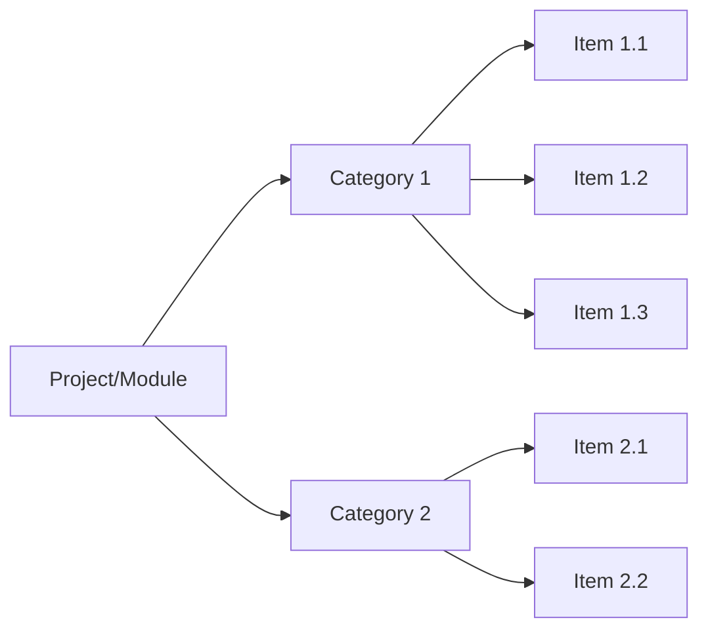
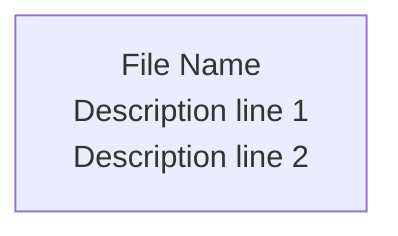
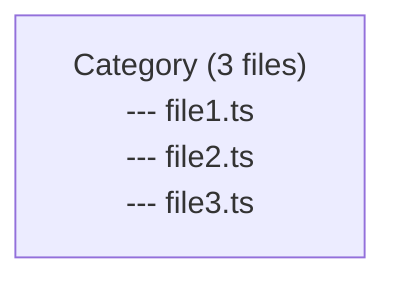
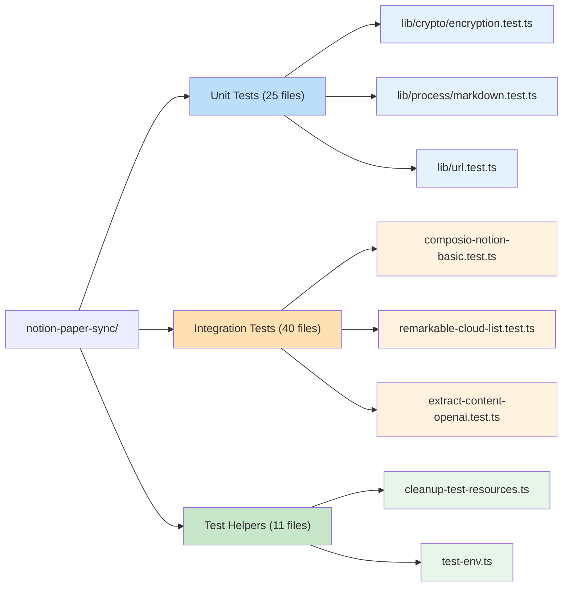

# Mermaid Diagrams Skill

Use this skill when creating hierarchical Mermaid diagrams. This skill captures best practices for visualization, particularly for file structures, test suites, and other tree-like data.

**Access this skill with:** `/skill mermaid-diagrams`

## Purpose

Create clear, well-structured Mermaid diagrams that effectively visualize hierarchical data. This skill provides patterns for parallel structures, color coding, and three-level hierarchies.

## When to Use

Create a Mermaid diagram when:
- Visualizing file structures or test suites
- Showing hierarchical relationships (categories -> items)
- Creating architectural overviews
- Documenting component relationships

## Directory Layout

Diagrams are stored in `./docs/diagrams/` at the project root if that directory exists. Otherwise, embed diagrams directly in relevant documentation files.

## Key Principles

### 1. Choose the Right Graph Direction

- **`graph LR`** - Left to Right (horizontal) - **Best for listing many items**
- **`graph TD`** or **`graph TB`** - Top to Bottom (vertical flow)
- **`graph BT`** - Bottom to Top (rarely used)

**Recommendation**: Use `graph LR` for hierarchical structures with many leaf nodes.

### 2. Parallel vs Sequential Connections

**Wrong - Sequential (creates a chain):**
```mermaid
Category --> Item1
Item1 --> Item2
Item2 --> Item3
```

**Correct - Parallel (independent items):**
```mermaid
Category --> Item1
Category --> Item2
Category --> Item3
```

### 3. Three-Level Hierarchy Pattern



## Color Coding

Apply consistent colors using the `style` directive:

```mermaid
style NodeID fill:#color-hex
```

**Recommended color scheme:**
- Categories: Darker, saturated colors (e.g., `#bbdefb`, `#ffe0b2`, `#c8e6c9`)
- Items: Lighter, matching colors (e.g., `#e3f2fd`, `#fff3e0`, `#e8f5e9`)

## Multi-line Text in Nodes

Use `<br/>` for line breaks:



For file trees, use Unicode box-drawing characters:


## Complete Example



## Common Pitfalls

1. **Using subgraphs for leaf nodes**: Subgraphs group nodes visually but can cause horizontal spreading. Use direct connections instead.

2. **Forgetting graph direction**: Always specify `LR`, `TD`, or `TB` - it dramatically affects layout.

3. **Chaining nodes unnecessarily**: Only chain nodes if they have actual dependencies or sequential flow.

4. **Inconsistent node IDs**: Use clear, descriptive IDs like `UNIT_TEST_1` not just `A`, `B`, `C`.

## Skill Activation

This skill activates when:
- Creating diagrams to visualize hierarchies
- User asks for a "diagram", "visualization", or "mermaid"
- Documenting file structures, test suites, or component relationships
- User provides data that would benefit from visual representation

## Resources

- [Mermaid Documentation](https://mermaid.js.org/intro/)
- [Mermaid Live Editor](https://mermaid.live/) - Test your diagrams
- [Color Picker](https://materialui.co/colors) - Material Design colors work well
