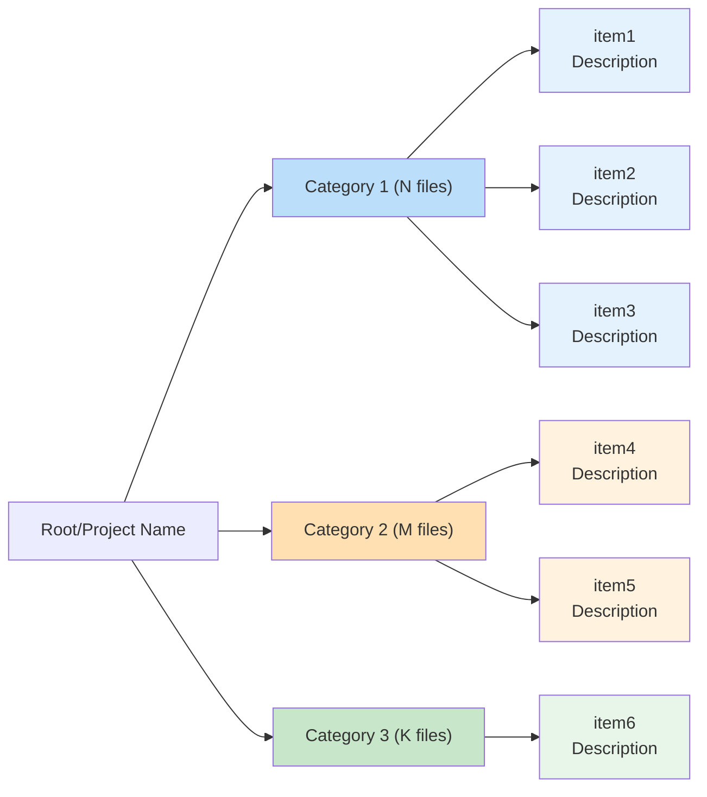

# Mermaid Diagram Template

Copy and adapt this template for hierarchical diagrams:

## Color Palette Reference

| Category Color | Item Color | Use For |
|---------------|------------|---------|
| `#bbdefb` | `#e3f2fd` | Blue - Unit tests, core components |
| `#ffe0b2` | `#fff3e0` | Orange - Integration tests, APIs |
| `#c8e6c9` | `#e8f5e9` | Green - Helpers, utilities |
| `#f8bbd9` | `#fce4ec` | Pink - UI components |
| `#d1c4e9` | `#ede7f6` | Purple - Services, middleware |
| `#b2dfdb` | `#e0f2f1` | Teal - Data layer, models |
